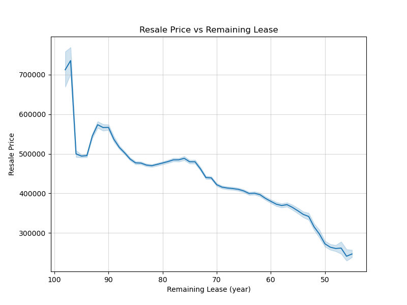
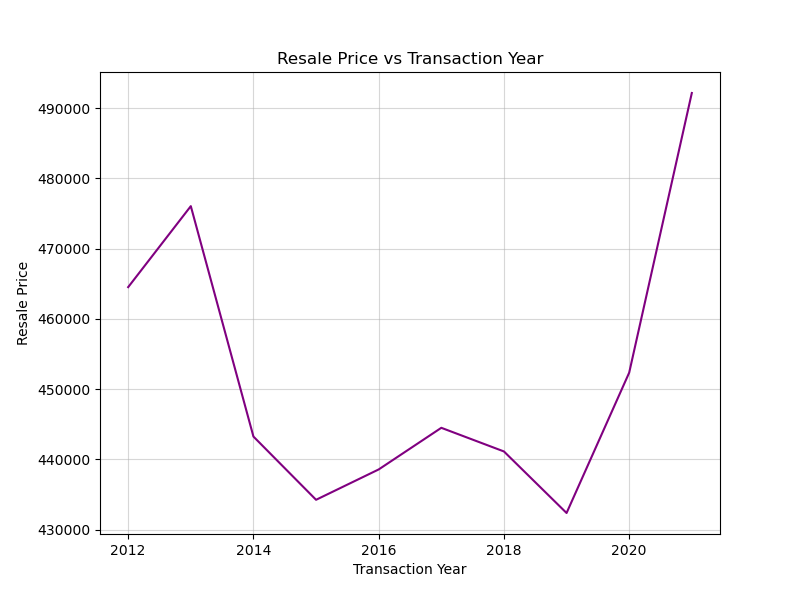
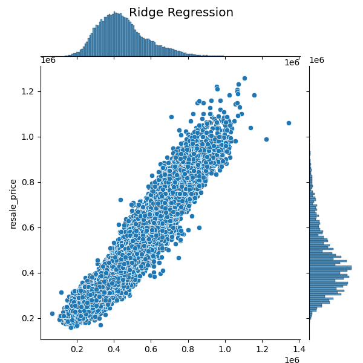

# Project 2: HDB Resale Price Prediction Based on Various Contributing Factors
---
## Problem Statement
HDB resale price has been steadily increasing over the decades, more significantly seen post COVID-19 pandemic. In fact, this price increase has been ongoing for the 13th consecutive quarter, since Singapore ended the two-month-long circuit breaker period in 2020. Despite HDB resale price showing signs of moderation compared to those of previous quarters (credits to government property cooling measures implementtion), understanding key factors that influence the price is crucial to maximize return of investment (ROI). This is especially applicable for those looking to buy Build-To-Order (BTO) flats, as they typically need longer waiting time for owners to receive their flats after down payments are made.

*Source: [The Straits Times](https://www.straitstimes.com/singapore/housing/hdb-resale-prices-up-14-in-q2-but-lower-than-quarter-average-in-2022-fewer-flats-sold).*

**Main Objective**

Our goals as property consultant specialist are to:
* Understand HDB features affecting Resale Price, to give recommendations to potential clients who are looking to buy a resale/BTO flats.
* Choosing the most suitable proposed model to successfully predict HDB Resale Price.

---

# Data Preparation & Exploration

The dataset given is available on [Kaggle](https://www.kaggle.com/competitions/dsi-sg-project-2-regression-challenge-hdb-price)

## Data Cleaning:
* `postal` feature has 33 entries with **'NIL'** value in postal column, they are filtered out. Also notice that some of the values only have 5 digits, this may be due to those postcode starting with 0. To ensure consistency in 6-digit Singapore postal code, '0' is added in front for those values, but due to dtype limitation, this feature is kept as string.
* There are missing values in mall and hawker related features. Upon checking they each have features identifying: 1) nearest distance 2) unit count within distance range. Cross referencing this set of features, we can deduce:
    * `Mall_Nearest_Distance` value is missing because there is no mall within 2km
    * `Hawker_Nearest_Distance` does not have missing value because it has data available beyond 2km
    * Missing value for unit count within distance range is due to the nearest distance is out of bound
    > Hence, we can safely replace the missing values with '0', and it will still be valid.

---
## Data Exploration:

Based on first-pass interpretation on feature descriptions, decided to drop some columns that may not be interpretable in modelling. (justication included in the table)

    
 Data Dictionary 

#|Features|Description|Dtype|Drop|Justification
---|---|---|---|---|---
0|id| NA|int64|
1|tranc_yearmonth| year and month of the resale transaction, e.g. 2015-02|object
2|town| HDB township where the flat is located, e.g. BUKIT MERAH|object
3|flat_type| type of the resale flat unit, e.g. 3 ROOM|object
4|block| block number of the resale flat, e.g. 454|object|Y|block number is random, may not be useful in model interpretation
5|street_name| street name where the resale flat resides, e.g. TAMPINES ST 42|object|Y|street name is too specific, may not be useful in model interpretation
6|storey_range| floor level (range) of the resale flat unit, e.g. 07 TO 09|object
7|floor_area_sqm| floor area of the resale flat unit in square metres|float64
8|flat_model| HDB model of the resale flat, e.g. Multi Generation|object
9|lease_commence_date| commencement year of the flat unit's 99-year lease|int64
10|resale_price| the property's sale price in Singapore dollars. **This is the target variable**|float64
11|tranc_year| year of resale transaction|int64
12|tranc_month| month of resale transaction|int64
13|mid_storey| median value of storey_range|int64|Y|similar feature as feature #6
14|lower| lower value of storey_range|int64|Y|similar feature as feature #6
15|upper| upper value of storey_range|int64|Y|similar feature as feature #6
16|mid| middle value of storey_range|int64|Y|similar feature as feature #6
17|full_flat_type| combination of flat_type and flat_model|object
18|address| combination of block and street_name|object|Y|address is too specific, may not be useful in model interpretation
19|floor_area_sqft| floor area of the resale flat unit in square feet|float64
20|hdb_age| number of years from lease_commence_date to present year|int64
21|max_floor_lvl| highest floor of the resale flat|int64
22|year_completed| year which construction was completed for resale flat|int64
23|residential| boolean value if resale flat has residential units in the same block|object
24|commercial| boolean value if resale flat has commercial units in the same block|object
25|market_hawker| boolean value if resale flat has a market or hawker centre in the same block|object
26|multistorey_carpark| boolean value if resale flat has a multistorey carpark in the same block|object
27|precinct_pavilion| boolean value if resale flat has a pavilion in the same block|object
28|total_dwelling_units| total number of residential dwelling units in the resale flat|int64
29|1room_sold| number of 1-room residential units in the resale flat|int64
30|2room_sold| number of 2-room residential units in the resale flat|int64
31|3room_sold| number of 3-room residential units in the resale flat|int64
32|4room_sold| number of 4-room residential units in the resale flat|int64
33|5room_sold| number of 5-room residential units in the resale flat|int64
34|exec_sold| number of executive type residential units in the resale flat block|int64
35|multigen_sold| number of multi-generational type residential units in the resale flat block|int64
36|studio_apartment_sold| number of studio apartment type residential units in the resale flat block|int64
37|1room_rental| number of 1-room rental residential units in the resale flat block|int64
38|2room_rental| number of 2-room rental residential units in the resale flat block|int64
39|3room_rental| number of 3-room rental residential units in the resale flat block|int64
40|other_room_rental| number of "other" type rental residential units in the resale flat block|int64
41|postal| postal code of the resale flat block|object
42|latitude| Latitude based on postal code|float64
43|longitude| Longitude based on postal code|float64
44|planning_area| Government planning area that the flat is located|object
45|mall_nearest_distance| distance (in metres) to the nearest mall|float64
46|mall_within_500m| number of malls within 500 metres|float64
47|mall_within_1km| number of malls within 1 kilometre|float64
48|mall_within_2km| number of malls within 2 kilometres|float64
49|hawker_nearest_distance| distance (in metres) to the nearest hawker centre|float64
50|hawker_within_500m| number of hawker centres within 500 metres|float64
51|hawker_within_1km| number of hawker centres within 1 kilometre|float64
52|hawker_within_2km| number of hawker centres within 2 kilometres|float64
53|hawker_food_stalls| number of hawker food stalls in the nearest hawker centre|int64
54|hawker_market_stalls| number of hawker and market stalls in the nearest hawker centre|int64
55|mrt_nearest_distance| distance (in metres) to the nearest MRT station|float64
56|mrt_name| name of the nearest MRT station|object
57|bus_interchange| boolean value if the nearest MRT station is also a bus interchange|int64
58|mrt_interchange| boolean value if the nearest MRT station is a train interchange station|int64
59|mrt_latitude| latitude (in decimal degrees) of the the nearest MRT station|float64
60|mrt_longitude| longitude (in decimal degrees) of the nearest MRT station|float64
61|bus_stop_nearest_distance| distance (in metres) to the nearest bus stop|float64
62|bus_stop_name| name of the nearest bus stop|object|Y|bus stop name is too specific, may not be useful in model interpretation
63|bus_stop_latitude| latitude (in decimal degrees) of the the nearest bus stop|float64
64|bus_stop_longitude| longitude (in decimal degrees) of the nearest bus stop|float64
65|pri_sch_nearest_distance| distance (in metres) to the nearest primary school|float64
66|pri_sch_name| name of the nearest primary school|object
67|vacancy| number of vacancies in the nearest primary school|int64
68|pri_sch_affiliation| boolean value if the nearest primary school has a secondary school affiliation|int64
69|pri_sch_latitude| latitude (in decimal degrees) of the the nearest primary school|float64
70|pri_sch_longitude| longitude (in decimal degrees) of the nearest primary school|float64
71|sec_sch_nearest_dist| distance (in metres) to the nearest secondary school|float64
72|sec_sch_name| name of the nearest secondary school|object
73|cutoff_point| PSLE cutoff point of the nearest secondary school|int64
74|affiliation| boolean value if the nearest secondary school has an primary school affiliation|int64
75|sec_sch_latitude| latitude (in decimal degrees) of the the nearest secondary school|float64
76|sec_sch_longitude| longitude (in decimal degrees) of the nearest secondary school|float64

  

Features are separated into 3 buckets:
1. binary
2. numerical (include periodic)
3. categorical

### Binary
* `residential` feature only has 1 unique value, to drop.
* Despite having relationshiop with resale price (based on mean value), `market_hawker`, `multistorey_carpark`, `precinct_pavilion` have very limited **'1'** value, this may skew the conclusion, to drop.
* Although there is no significant relationship with resale price, the rest of the features have sufficiently distributed values, will keep these features.

### Numerical
Apart from `floor_area_sqm` and `floor_area_sqft`, observe no significant relationship from other features. To drop **sqft** version as it is redundant.

### Periodic
Observe there are 4 periodic variables: `lease_commence_date`, `tranc_year`, `tranc_month`, `year_completed`, `hdb_age`. create a new feature `remaining_year` to calculate the remaining year (out of 99 years) at the point of sale.

  
  
  

* HDB price slumped in 2014 due to [government cooling measures](https://stackedhomes.com/editorial/singapore-cooling-measures-history/) and has been stagnant for half a decade, before [climbing 5% in 2020 during pandemic](https://www.straitstimes.com/business/property/sales-of-hdb-resale-flats-hit-8-year-high-in-2020-as-prices-climb-5 ).
* There is no clear annual trending of resale price. The increase/decrease in price is likely due to price fluctuation over the year.

### Categorical
* `flat_type` has a strong relationship with HDB price, which is expected, with more bedroom and executive/multigen type being more valuable.
*  `storey_range` also shows trending with higher floor scoring higher price.

---

# Model Preparation (Feature Engineering)

Perform train-test split with 0.4 test ratio.  
Recall different features:
* Binary
* Categorical
* Numerical

>Categorical features are encoded, while numerical are scaled. Afterwards, three of them are joined together.

---
# Model Evaluation
3 Models are evaluated:
* Linear Regression (baseline model)
* Ridge Regression
* Lasso Regression

Metrics|Linear Regression|Ridge Regression|Lasso Regression
---|---|---|---
Model Accuracy (R2)|-5.8 x 10^16|0.915|0.897
Error in Prediction (RMSE)|3.4 x 10^13|41,625|45,664
Model fitting (Train-Test % difference)|100,000,000,000%|0.1%|0.1%

    
* **Ridge Regression** has the highest model accuracy and demonstrate repeatability.
* **Linear regression** is worst with significantly varying result during cross-validation (model not robust).

---
# Conclusion and Recommendation
* **Best Model**: Ridge Regression
    * Most Accurate Model with ~91% accuracy (R2)
    * Model able to predict with ~$41k error
    * Demonstrate repeatability with 0.1% difference
* **Top 3 contributing factors**:
    * Flat model/type
    * Flat Storey
    * Nearest MRT
* **Future Improvement**:
    * Consider Time Series Testing
        * As seen in EDA section, data span across period where price fluctuated.
        * Potential time dependency that could skew the conclusion.
        * Train data could be based on past and test on the latest time-frame.
    * Consider More Features
        * Economic Indicators (e.g. interest rate, GDP)
        * Updated Policies (LTV rate, ABSD rate, [MOP](https://www.propertyguru.com.sg/property-guides/mop-sell-hdb-singapore-16413))
        * HDB Condition (renovated block)

---
# References
* [The Straits Times - HDB resale prices Q2 2023](https://www.straitstimes.com/singapore/housing/hdb-resale-prices-up-14-in-q2-but-lower-than-quarter-average-in-2022-fewer-flats-sold)
* [Stacked Homes- Singapore History of Cooling Measures since 2009](https://stackedhomes.com/editorial/singapore-cooling-measures-history/)
* [The Straits Times - HDB resale prices Q4 2021](https://www.straitstimes.com/business/property/sales-of-hdb-resale-flats-hit-8-year-high-in-2020-as-prices-climb-5 )
* [PropertyGuru - HDB MOP (Minimum Occupation Period) Guide](https://www.propertyguru.com.sg/property-guides/mop-sell-hdb-singapore-16413)